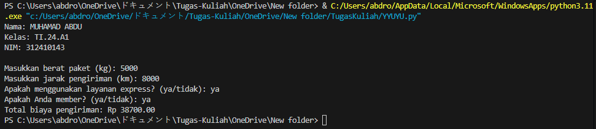

# Tugas1L
# Code
# Informasi Pengguna
nama = "MUHAMAD ABDU"
kelas = "TI.24.A1"
nim = "312410143"

print(f"Nama: {nama}")
print(f"Kelas: {kelas}")
print(f"NIM: {nim}")
print()

def hitung_biaya_pengiriman(berat, jarak, express, member):
    # Biaya dasar
    biaya_dasar = 10000
    
    # Tambahan biaya berdasarkan berat
    if berat > 5:
        biaya_berat = 5000
    else:
        biaya_berat = 0
    
    # Tambahan biaya berdasarkan jarak
    if jarak > 10:
        biaya_jarak = 8000
    else:
        biaya_jarak = 0
    
    # Tambahan biaya untuk layanan express
    if express:
        biaya_express = 20000
    else:
        biaya_express = 0
    
    # Hitung total biaya sebelum diskon
    total_biaya = biaya_dasar + biaya_berat + biaya_jarak + biaya_express
    
    # Hitung diskon untuk member
    if member:
        diskon = total_biaya * 0.10
    else:
        diskon = 0
    
    # Hitung total biaya setelah diskon
    total_setelah_diskon = total_biaya - diskon
    
    return total_setelah_diskon

# Input dari pengguna
berat = float(input("Masukkan berat paket (kg): "))
jarak = float(input("Masukkan jarak pengiriman (km): "))
express_input = input("Apakah menggunakan layanan express? (ya/tidak): ").strip().lower()
member_input = input("Apakah Anda member? (ya/tidak): ").strip().lower()

# Konversi input layanan express dan member ke boolean
express = express_input == 'ya'
member = member_input == 'ya'

# Hitung total biaya pengiriman
total = hitung_biaya_pengiriman(berat, jarak, express, member)

# Tampilkan hasil
print(f"Total biaya pengiriman: Rp {total:.2f}")

# Penjelasan Code
1.Informasi Pengguna: Di bagian atas kode, terdapat variabel nama, kelas, dan nim yang menyimpan informasi Anda. Informasi ini dicetak ke layar sebelum program meminta input dari pengguna.

2.Fungsi dan Logika: Fungsi hitung_biaya_pengiriman dan logika perhitungan biaya tetap sama seperti sebelumnya.

3.Input dan Output: Program tetap meminta input dari pengguna dan menampilkan total biaya pengiriman setelah perhitungan

4.Fungsi hitung_biaya_pengiriman: Fungsi ini menerima parameter berat, jarak, status express, dan status member. Di dalam fungsi ini, kita menghitung biaya berdasarkan aturan yang telah Anda berikan.

5.Biaya Dasar: Biaya dasar ditetapkan sebesar Rp 10.000.

6.Tambahan Biaya: Menggunakan kondisi if untuk menentukan apakah ada tambahan biaya berdasarkan berat dan jarak.

7.Layanan Express: Jika pelanggan memilih layanan express, biaya tambahan ditambahkan.

8.Diskon untuk Member: Jika pelanggan adalah member, diskon 10% dari total biaya dihitung.

9.Input Pengguna: Program meminta input dari pengguna untuk berat, jarak, dan status layanan express serta member.

10.Output: Total biaya pengiriman ditampilkan dengan format yang sesuai.

# Output

